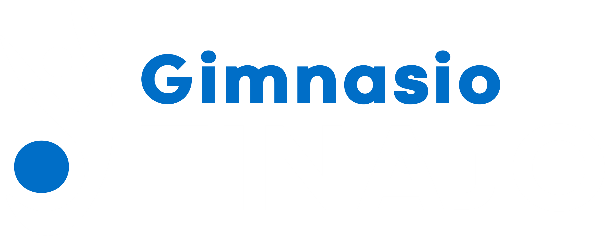

## Gym Tinajo

**Gym Tinajo** es una plataforma web innovadora creada para ofrecer una experiencia de gimnasio única y moderna. Este proyecto permite a los usuarios gestionar sus **reservas de clases** y **contratos de tarifas** de manera fácil y eficiente. Nuestra web facilita todo el proceso, permitiendo a los miembros elegir y reservar su clase ideal con solo unos clics.

Además, para mejorar la interacción y atención al cliente, **Gym Tinajo** integra un **chatbot inteligente con IA**, disponible tanto para **invitados** como para **clientes registrados**. Este asistente virtual está diseñado para proporcionar respuestas sobre ejercicios, rutinas y dietas, ofreciendo asistencia personalizada en tiempo real. ¡Obtén recomendaciones y consejos de fitness al instante y mejora tu rendimiento en el gimnasio!

Con **Gym Tinajo**, los usuarios disfrutan de:

- **Reservas fáciles y rápidas** para cualquier clase.
- Acceso a **detalles claros sobre tarifas y clases.**
- **Asistencia 24/7** gracias al chatbot basado en inteligencia artificial.

Este proyecto es ideal tanto para gimnasios que buscan optimizar su gestión como para los usuarios que desean disfrutar de un gimnasio de forma ágil, eficiente y con la tecnología más avanzada.

## ¿Qué pueden hacer los diferentes usuarios en Gym Tinajo?

**Gym Tinajo** está diseñado para ofrecer una experiencia de usuario completa, adaptada a las necesidades de **invitados, clientes** y **administradores**. Cada tipo de usuario tiene acceso a un conjunto específico de funcionalidades para que puedan aprovechar al máximo el servicio.

### Invitado:

Como **invitado**, puedes explorar y conocer lo que **Gym Tinajo** tiene para ofrecer, sin necesidad de crear una cuenta. Disfruta de las siguientes funciones:

- **Consulta información básica** sobre el gimnasio: conoce nuestras **clases, eventos, horarios y profesores.**
- **Interacción con el chatbot:** recibe respuestas rápidas sobre **ejercicios, rutinas de entrenamiento y dietas.**

Invitar a tus amigos a conocer más sobre nosotros nunca fue tan fácil.

### Cliente:

Los **clientes** tienen acceso a todo lo que un invitado puede ver, además de una serie de funcionalidades exclusivas una vez se registran:

- **Consulta información detallada** sobre las clases, eventos y los profesores.
- **Uso del chatbot:** recibe asesoramiento personalizado en **ejercicios, dietas y rutinas** para mejorar tu rendimiento.
- **Reservas de clases:** después de **contratar una tarifa,** podrás reservar clases según tu disponibilidad, asegurando que tu experiencia sea siempre la mejor

Los clientes tienen el control para organizar sus entrenamientos y adaptarlos a sus necesidades.

### Administrador:

Como **administrador,** tendrás acceso completo a todas las funcionalidades para gestionar el gimnasio de manera eficiente

- **Gestión de clientes y reservas:** Puedes **crear, ver, editar y eliminar** reservas de clases de todos los usuarios, así como gestionar la información de los clientes.
- **Control total de las reservas:** Organiza y administra las reservas de clases para que el gimnasio funcione de manera óptima.
- **Gestión de tarifas** e **información general:** Administra las tarifas disponibles y ajusta los datos relacionados con las clases y horarios.

Aunque los administradores no pueden interactuar con el chatbot, tienen el control total para garantizar el buen funcionamiento del gimnasio.

## Laravel Sponsors

We would like to extend our thanks to the following sponsors for funding Laravel development. If you are interested in becoming a sponsor, please visit the [Laravel Partners program](https://partners.laravel.com).

### Premium Partners

- **[Vehikl](https://vehikl.com/)**
- **[Tighten Co.](https://tighten.co)**
- **[WebReinvent](https://webreinvent.com/)**
- **[Kirschbaum Development Group](https://kirschbaumdevelopment.com)**
- **[64 Robots](https://64robots.com)**
- **[Curotec](https://www.curotec.com/services/technologies/laravel/)**
- **[Cyber-Duck](https://cyber-duck.co.uk)**
- **[DevSquad](https://devsquad.com/hire-laravel-developers)**
- **[Jump24](https://jump24.co.uk)**
- **[Redberry](https://redberry.international/laravel/)**
- **[Active Logic](https://activelogic.com)**
- **[byte5](https://byte5.de)**
- **[OP.GG](https://op.gg)**

## Contributing

Thank you for considering contributing to the Laravel framework! The contribution guide can be found in the [Laravel documentation](https://laravel.com/docs/contributions).

## Code of Conduct

In order to ensure that the Laravel community is welcoming to all, please review and abide by the [Code of Conduct](https://laravel.com/docs/contributions#code-of-conduct).

## Security Vulnerabilities

If you discover a security vulnerability within Laravel, please send an e-mail to Taylor Otwell via [taylor@laravel.com](mailto:taylor@laravel.com). All security vulnerabilities will be promptly addressed.

## Documentos de interés

Consulta los siguientes documentos para obtener información detallada sobre el proceso de desarrollo:

- [Documento de análisis](https://drive.google.com/file/d/1JYtGxBnd7t1Mh1d-TopQswQT5oJZd6gz/view?usp=sharing)
- [Documento de diseño](https://drive.google.com/file/d/1vc1F60KjAmhHbwuSaGle54EMch1z8vvw/view?usp=sharing)